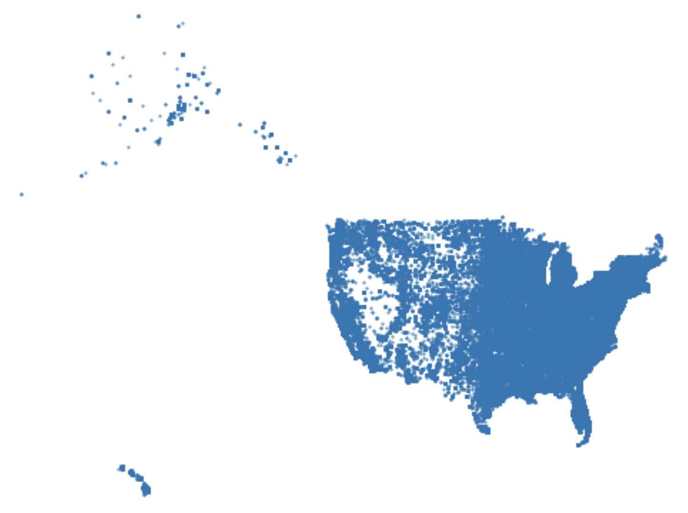
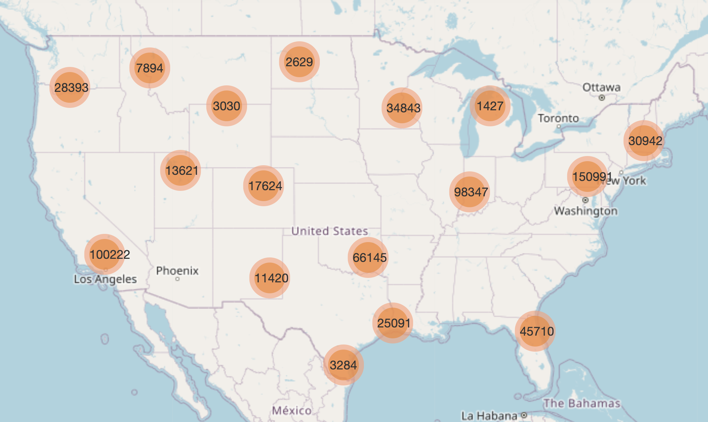
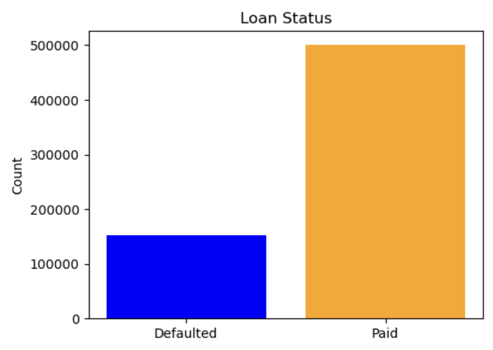
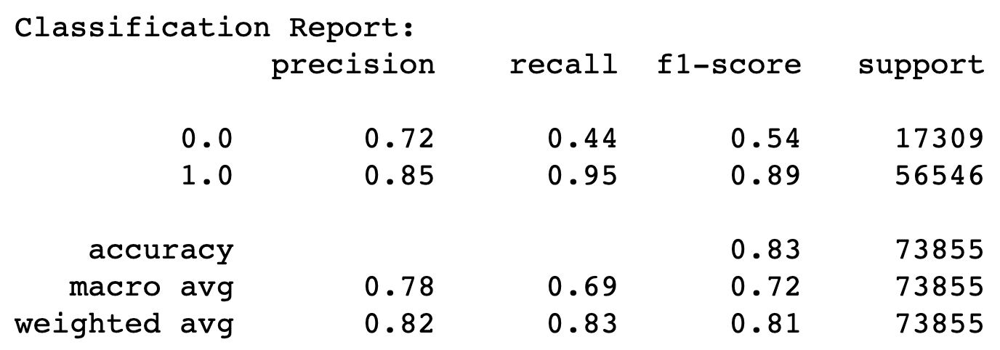
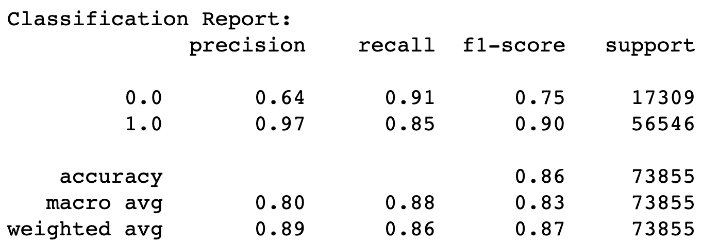
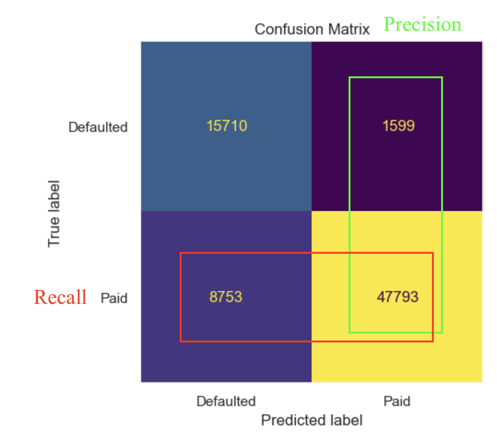
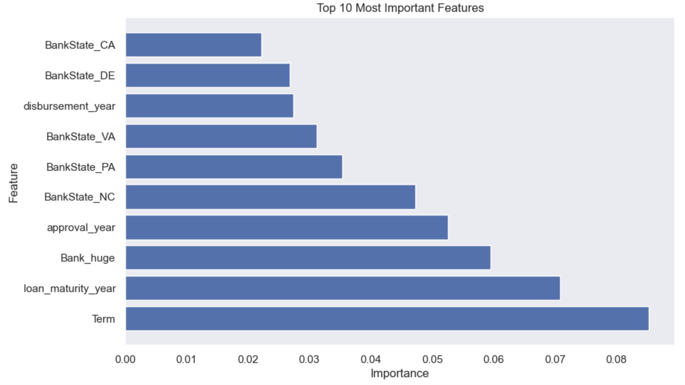

#### 07/30/23

#### Joshua Edelstein

# Loan Default

## Overview
Primary revenue generation for banks heavily relies on the dispersion of loans, with the pivotal factor being the successful repayment of these loans. The assurance of loan repayment plays a critical role in enhancing their revenue streams. However, the default rate has exhibited a concerning upward trend. It has become imperative for banks to retain the capacity to extend loans while maintaining the confidence that a substantial proportion will be promptly repaid.

Recent developments underscore the gravity of the situation. Notably, in the month of June alone, four corporate entities filed for bankruptcy. This series of events pushed the cumulative default volume for the preceding 12 months to a staggering $24 billion, marking the highest figure recorded since April 2021. These occurrences shed light on the growing challenges banks face in maintaining the delicate equilibrium between extending credit and safeguarding their financial stability.

## Business Understanding
The American Bankers Association has come to us to try fix the issue of the rising default rates. Although many banks have a strong customer base and are constantly offering loans, their clients are defaulting on loans at a much higher rate than they would have liked. We are tasked we figuring out possible problems and solutions with the current lending process. 

In this scenario we will break the data into 2 categories: a) the columns used to predict default. b) the default column itself, which will be structured in the positive. Meaning that a 1 in that column will mean that it was paid back.

It is important to take into account whether the affects of a false positive vs false negative is worse. In this case we are predicting whether a loan will be paid back. Therefore a false positive means we predict a loan will be paid back, when in reality it won't be, this is seen by precision. A false negative is when we predict a customer won't pay a loan back, when in reality they do pay it back, this is seen by recall. In this case it slightly depends on what the bank is looking for, but since our bank has a steady flow of clients, we don't need to be concerned about turning customers away from loans. As such precision is far more important here, as the result of a false positive is losing out on the principle of the whole loan. While a false negative means that we wont offer a loan, and thus won't gain the extra interest over the course of a few years. As such we will attempt to tune our model to more heavily focus on precision.

## Data Understanding

The public data set was provided by the SBA(Small Business Association) and can be downloaded from kaggle. The years the loans were approved range from 1969 to 2014. However, the range of the loans due date was from 1973 until 2035. We see that we are dealing with many loans that are not even due yet.

Data Source: https://www.kaggle.com/datasets/mirbektoktogaraev/should-this-loan-be-approved-or-denied

We began by performing EDA on our data.

The first thing we looked at is where in the USA the data came from. We had to merge our data that contained zipcodes with a different dataframe that contained longitude and latitude. At first we plotted our longitude and latitudes on a blank background. Being that there were so many datapoints, it created a pretty good map of the USA. 

We then moved on to create a fancier map that Folium and clustering. This map was interactive and created clusters of data points depending on how much you zoomed in or out

Finally, we pulled up a bar graph of the breakdown of our target column, whether the loan was paid back or not. 

The breakdown of the loans was that 76.6% were paid back and 23.4% defaulted. As such we see that we are dealing with a slightly imbalanced dataset. We then moved on to our data preparation stage.

## Data Preparation

Being that we were dealing with a very messy dataset, there was a lot of cleaning that needed to be done. To prevent data leakage we did a `train_test_split` before any of the cleaning. The cleaning was composed of dropping rows, dropping columns, creating dummy columns, stripping string data and reformating, and making sure everything was stored as the right datatype. I will now highlight three major steps in the cleaning process. 

One of the columns in our dataset contained the bank that offered the loan. This is very useful information; however, there were over 5000 value counts, making the data unusable in its current format. We needed to figure out a way to group the data so that there was a reasonable amount of value counts, allowing us to create dummy columns. In the end, we decided to rename all the values based on a dictionary depending on the size of the chain. In the end we only had six different values ranging from `Bank_huge` to `Bank_tiny`.

The next column we needed to fill was a boolean column indicating whether the business was in a urban area or rural area. This column had over 200,000 missing values. To fill this column we found the urban rural codes for all zipcodes in the USA, and merged this on to our dataframe, to fill almost all the missing values.

The last column we needed to fill, was another boolean column which indicated whether the business had a revolving line of credit. This column contained over 100,000 missing values, and there was no clearn way how to fill them. We did some EDA on the column and discovered that although the column in general had more 0s than 1s. In the years that there were missing values the columns actually contained more 1s than 0s. We then created four theoretical ways to clean the data, the first was to drop all the rows with missing data, the second was drop the column, the third was to fill all the missing values with 1s, and the last was to create a dummy column for 0,1 and missing. We then ran a very basic Decision Tree Classifier on them to determine which way performed the best. In the end the dummy columns performed the best, as such we set it inplace and moved on to our modeling

## Data Analysis/ Modeling

### Baseline Model

We'll begin our modeling with a Logistic Regression model. This works by adjusting the coefficients of the predictors using gradient descent. Which attempts to minimize the difference between predicted probabilities and the binary values.

Here are the results of our model:

This is a fine model for our baseline, with a respectable f1-score. However, in our specific case we care more about precision and as such we want to tweak our model in that direction. 

### Final Model

For our final model we used an XGBoost classifier. This model is created by training a weak learner on the data, using gradient descent to minimize the loss function. Then calculating the residuals, and training a model on those residuals. As such each new learner is trained to correct the previous predictor's error. This is done a specified number of times, then the final model is a weighted combination of all the models based on its reduction to the loss function. The base model for XGBoost is a Decision Tree. Although there were models that had slightly better precision, the XGBoost model was over 100 times faster, as such we chose it for our final model. Our final model was tuned to have a threshold of .6 meaning that the model had to be atleast 60% certain the loan would be paid back to predict it would be paid back

Here are the results of our final model:

Additionally, this model had a ROC score of .88. Here is the confusion matrix for our final model:

The model was tested on 73,855 businesses in the testing data set there was 17,309(15,710+1,599) people that defaulted on their loans, giving us a default rate of 23%. The model correctly predicted the loan status of 63,503(47,793+15,710) people, this gives us the accuracy score we saw above of 86%. The model correctly captured 47,793 of the 56,546 people who paid back their loans, giving us the recall score of 85%. Out of the 49,392 people that the model predicted would pay back their loan, the model only predicted incorrectly on 1,599 people. This gave us a precision score of 97%. The recall and precision scores were combined to give us an f1 score of .90.

Here are the top 10 most important features:

We see that the most important factor are composed of four main categories: 1) Length of the loan. 2) Year of the loan. 3) Size of the bank. 4) State of the Bank. 

## Conclusion
We will now sum up our findings from our analysis and modeling:

1. Model Type:
- XGBoost- accomplished by training a weak learner on the data, using gradient descent to minimize the loss function. Then calculating the residuals, and training a model on those residuals. As such each new learner is trained to correct the previous predictor's error. This is done a specified number of times, then the final model is a weighted combination of all the models based on its reduction to the loss function. The base model for XGBoost is a Decision Tree.

2. Model Scoring:
- Accuracy score 86%
- F1-score of .90
- Precision of 97%
- Recall of 85%

3. Model Choice:
- Firstly, we can see the tremendous improvement in all areas of our final model from our baseline model.  Especially in terms of precision our model improved from 85% to 97%. This allows us to have confidence in our model when it predicts someone will pay back a loan
- We chose this model as our final model as it had the best combination of precision and time to run the model.

4. Feature Importance:
The most important features fell into 4 main categories:
- The first was `Term` or the length of the loan given. We noticed that there were a few relative modes at 5, 7, 10, 15, 20. At all these term lengths the default rate was significantly lower than the rest of the loans, with 4/5 having a default rate below 5%. For the vast majority of the other term lengths the default rate was above 40%. For any loan below 5 years the default rate was between 46%-71%.
- The next most important factor was the year of the loan. The default seemed like it was highly affected but what was going on in the economy as well as the world at that time.
- The next factor was the size of the bank, which seemed to have loan default rates similar to a normal distribution. Meaning that the larger the bank chain or the smaller the bank chain the higher the default rate was. The banks that were middle sized had better default rates. As we noted earlier, this may not be such an issue, as the larger banks are willing to have a higher default rate in return for a far greater volume of clients.
- Lastly, the default rates varied from state to state, ranging from 64% to 91%. 

## Recommendations
- We recommend that the American Bankers Association, sell our model to all banks. This should definitely lower the default rate, as our model had a precision of 97%.
- Although we can't determine if there is a direct cause and effect relationship between shorter loans and higher default rate. Banks should definitely be more cautious with businesses asking for shorter term loans, especially when those loans are a significant sum of money.
- Notify big banks that overall their default rates are much higher, and clarify if this is an issue. 

## Limitations
- One of the more important predictors was the year the loan was given, this is helpful for historical analysis but this won't be as helpful if we are trying to predict a current loan. 
- The dataset is very helpful when looking at general trends; however, there is a lot of information that could be added about the business asking for the loan. This includes, age of the business, purpose of loan, type of business, and other factors.

## Next Steps
Moving forward we will offer a few possible steps to American Bankers Association:

- Collect more data regarding the business asking for the loan, in hopes of improving the precision, as well as significantly improving the recall.
- Look further into the relationship between term length and default rate, as well as bank size and default rate. 

## For More Information

See the full analysis in the <a href="https://github.com/joshuaedelstein15/Loan_default/blob/main/notebook.ipynb">Jupyter Notebook</a> or review this <a href="https://github.com/joshuaedelstein15/Loan_default/blob/main/presentation.pdf">presentation</a>.

For additional info, contact Joshua Edelstein at joshuaedelstein15@gmail.com

## Repository Structure

This repository contains the following files and directories:

images/: This directory contains images used in the readme and presentation.  
.gitignore/: This directory includes things we dont want to push, as well as our data.  
README/: This directory gives a brief overview of the project.  
notebook/: This directory contains a Jupyter notebook used for data exploration, modeling, and analysis.  
presentation/: This directory includes the pdf of our presentation.

### References
- https://www.kaggle.com/code/ricardocolindres/loan-default-prediction-loan-parameter-optimizer
- https://www.youtube.com/watch?v=H8Ypb8Ei9YA